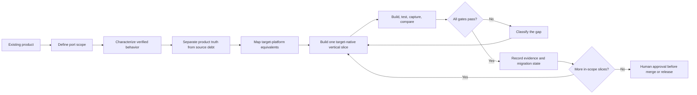

# xilantra/skills

Reusable Agent Skills by Afiq Xilantra Azmi.

## Included skill

### `cross-platform-app-port`

Ports an existing app, feature, or user flow from one platform or framework to another while preserving verified product behavior and producing a maintainable, target-native implementation.

The skill supports workflows such as:

- iOS to Android
- Android to iOS
- Web to native mobile
- Electron to native desktop
- UIKit to SwiftUI
- Views to Jetpack Compose
- React Native or Flutter to native platforms

## Bird's-eye view



The loop may run interactively or within explicit limits for long-running work. It must stop for blockers, exhausted budgets, iteration limits, or actions that require human approval.

## Install this skill

```bash
npx skills add https://github.com/Xilantra/skills --skill cross-platform-app-port
```

## Install all Xilantra skills

```bash
npx skills add xilantra/skills
```

The Skills CLI installation pattern is documented by [skills.sh](https://skills.sh/).

## Validate

Run the bundled structural validator:

```bash
python cross-platform-app-port/scripts/validate_skill.py cross-platform-app-port
```

Validate the migration-state template:

```bash
python cross-platform-app-port/scripts/validate_migration_state.py \
  cross-platform-app-port/assets/MIGRATION_STATE.template.json
```

Then run the official Agent Skills reference validator when available:

```bash
skills-ref validate ./cross-platform-app-port
```

## Development status

Version `0.2.0` adds workflow scaling, bounded and multi-agent loop controls, commit-bound verification evidence, human approval gates, and bird's-eye workflow diagrams. The included eval cases still need real-agent runs with and without the skill before claiming a measured pass rate.

## License

MIT. See [LICENSE](LICENSE).
