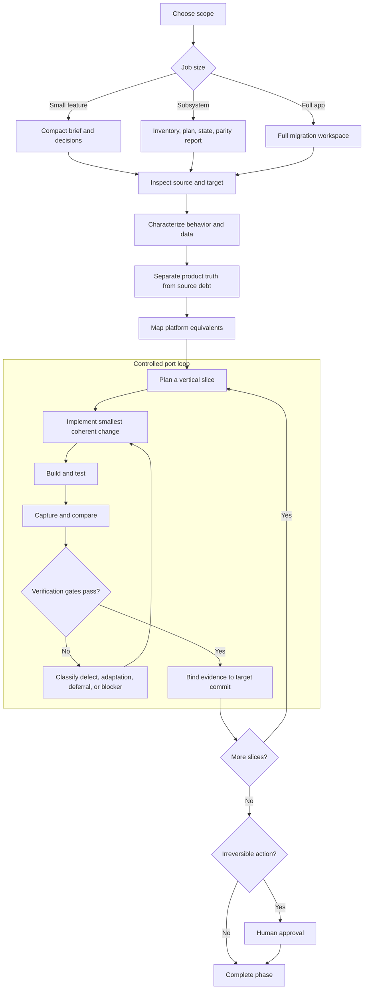

# Cross-Platform App Port

An Agent Skill for rebuilding an existing product on another platform or framework.

## Core promise

Preserve verified product behavior, data meaning, and visual intent. Do not reproduce source technical debt by default. Use the target platform's supported conventions where they improve maintainability, accessibility, performance, or platform fit.

## Workflow overview



For unattended or multi-agent execution, the loop is allowed only with objective gates, explicit limits, reversible workspaces, recorded terminal reasons, and human approval before irreversible actions.

## Install this skill

```bash
npx skills add https://github.com/Xilantra/skills --skill cross-platform-app-port
```

## Install all Xilantra skills

```bash
npx skills add xilantra/skills
```

## Distinguishing features

- Starts with a user-authored port brief, including desired improvements
- Scales documentation to a feature, subsystem, or full-app migration
- Separates required parity from optional improvements and deferred scope
- Treats the source app as the product reference, not the architecture template
- Uses vertical slices rather than a screen-only bulk rewrite
- Maintains persistent migration state across sessions
- Supports bounded and multi-agent loops with explicit stop conditions
- Binds completion evidence to the exact target commit verified
- Verifies behavior, visuals, accessibility, performance, and target-code quality
- Records target-side optimizations that may also benefit the source app
- Requires human approval before merge, deployment, submission, or destructive changes

## Files

```text
cross-platform-app-port/
├── SKILL.md
├── README.md
├── references/
│   ├── architecture-policy.md
│   ├── loop-control.md
│   ├── migration-state.md
│   ├── parity-and-verification.md
│   ├── platform-equivalence.md
│   └── port-brief.md
├── assets/
│   ├── ARCHITECTURE_DECISION.template.md
│   ├── DECISIONS.template.md
│   ├── FEATURE_INVENTORY.template.csv
│   ├── MIGRATION_PLAN.template.md
│   ├── MIGRATION_STATE.template.json
│   ├── PARITY_REPORT.template.md
│   ├── PORT_BRIEF.example.md
│   ├── PORT_BRIEF.template.md
│   └── UPSTREAM_RECOMMENDATIONS.template.md
├── scripts/
│   ├── compare_screenshots.py
│   ├── validate_migration_state.py
│   └── validate_skill.py
└── evals/
    ├── README.md
    └── evals.json
```

## Validate the package

```bash
python scripts/validate_skill.py .
python scripts/validate_migration_state.py assets/MIGRATION_STATE.template.json
```

For the screenshot tool:

```bash
python -m pip install Pillow
python scripts/compare_screenshots.py reference.png target.png --output diff.png --report diff.json
```

Use the official validator when available:

```bash
skills-ref validate .
```

## Sources used for the skill design

- [Agent Skills specification](https://agentskills.io/specification)
- [Best practices for skill creators](https://agentskills.io/skill-creation/best-practices)
- [Evaluating skill output quality](https://agentskills.io/skill-creation/evaluating-skills)

## Release status

`0.1.0` is ready for repository review and real-agent evaluation. The included evals are test definitions, not evidence that the skill has passed them.
